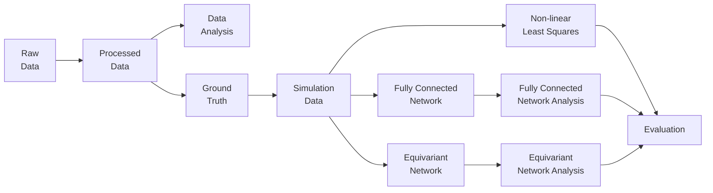

# GDL-DTI

## Pipeline

## Overview

<table>
<tbody>
  <tr>
    <td class="bold" rowspan="3">Physics Equation</td>
    <td class="bold" colspan="5">Model</td>
  </tr>
  <tr>
    <td class="bold" rowspan="2">Non-linear Least Squares</td>
    <td class="bold" colspan="3">Fully Connected</td>
    <td class="bold" rowspan="2">Equivariant</td>
  </tr>
  <tr>
    <td colspan="2">self-supervised</td>
    <td>supervised</td>
  </tr>
  <tr>
    <td>DTI</td>
    <td>Full Rank</td>
    <td>Full Rank</td>
    <td>-</td>
    <td>Full Rank</td>
    <td>Irreps</td>
  </tr>
  <tr>
    <td>IVIM-DTI</td>
    <td>Full Rank</td>
    <td>Full Rank </td>
    <td>Irreps </td>
    <td>- </td>
    <td>Irreps</td>
  </tr>
</tbody>
</table>

## Experiments

Tracking of experiments in `track.drawio` file.