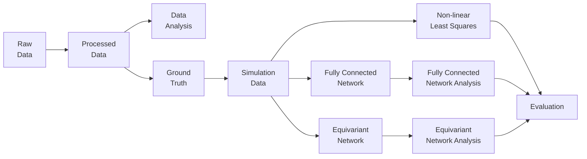

# GDL-DTI

Brain diseases still pose a great challenge in modern clinical practice. Diffusion tensor imaging (DTI) is a non-invasive imaging method that studies the 3-dimensional movement of water molecules in tissues. This information is represented by a 3x3 diffusion tensor. When applied to the brain it can provide insights about brain connectivity and micro-structural abnormalities.  

The most common approach to estimate the diffusion tensor is non-linear least squares fitting. However, artificial neural networks can take advantage of similarities between different brain regions. We employed two types of neural networks: fully connected and equivariant. Fully connected networks are simple yet effective, and equivariant networks are designed to handle data with a geometric structure like diffusion signals when visualized on a sphere. To compare them with non-linear least squares we created simulated data for the IVIM-DTI physical model, a combination of the intra-voxel incoherent motion (IVIM) model with tensors to describe the diffusion and the perfusion parameters of IVIM. Performance was measured in terms of diffusion eigenvectors and eigenvalues, mean diffusivity, and fractional anisotropy.

Our findings indicate that the fully connected network estimated diffusion parameters with lower error variance and fewer outliers than non-linear least squares, especially in predicting eigenvalues and fractional anisotropy. In contrast, the equivariant network’s performance did not consistently match non-linear least squares, but its unique properties make it a promising area for further research. Finally, this study suggests that different network architectures, noise distributions, and diverse datasets could enhance the performance of either type of neural network for the IVIM-DTI parameters.

## Overview

<table border-collapse="collapse">
<tbody>
  <tr>
    <td style="text-align:center;vertical-align:center;font-weight:bold;" rowspan="3">Physics Equation</td>
    <td style="text-align:center;vertical-align:center;font-weight:bold;" colspan="5">Model</td>
  </tr>
  <tr>
    <td style="text-align:center;vertical-align:center;font-weight:bold;" rowspan="2">Non-linear Least Squares</td>
    <td style="text-align:center;vertical-align:center;font-weight:bold;" colspan="3">Fully Connected</td>
    <td style="text-align:center;vertical-align:center;font-weight:bold;" rowspan="2">Equivariant</td>
  </tr>
  <tr>
    <td style="text-align:center;vertical-align:center;" colspan="2">self-supervised</td>
    <td style="text-align:center;vertical-align:center;">supervised</td>
  </tr>
  <tr>
    <td style="text-align:center;vertical-align:center;">DTI</td>
    <td style="text-align:center;vertical-align:center;">Full Rank</td>
    <td style="text-align:center;vertical-align:center;">Full Rank</td>
    <td style="text-align:center;vertical-align:center;">-</td>
    <td style="text-align:center;vertical-align:center;">Full Rank</td>
    <td style="text-align:center;vertical-align:center;">Irreps</td>
  </tr>
  <tr>
    <td style="text-align:center;vertical-align:center;">IVIM-DTI</td>
    <td style="text-align:center;vertical-align:center;">Full Rank</td>
    <td style="text-align:center;vertical-align:center;">Full Rank </td>
    <td style="text-align:center;vertical-align:center;">Irreps </td>
    <td style="text-align:center;vertical-align:center;">- </td>
    <td style="text-align:center;vertical-align:center;">Irreps</td>
  </tr>
</tbody>
</table>

First experiment attribute is the physics equation (DTI or IVIM-DTI). Second experiment attribute is the type of model (non-linear least squares, fully connected, or equivariant). Third experiment attribute is the representation (full rank or
irreps).

## Physics Equations

DTI : $\quad \quad \quad  S(b, g_k) = S0 \cdot \exp(-b \cdot g_k^T \cdot \bar{D} \cdot g_k)$

IVIM-DTI : $\quad  S(b, g_k) = S0 \cdot \Bigr[ f^* \cdot \exp(-b \cdot g_k^T \cdot \bar{D}^* \cdot g_k) + (1 - f^*) \cdot \exp(-b \cdot g_k^T \cdot \bar{D} \cdot g_k) \Bigl]$

$S0$ is the baseline signal, $b$ is the b-value, $g_k$ is the diffusion direction vector, $f^*$ is the perfusion fraction, $\bar{D}$ is the 3x3 diffusion tensor, and $\bar{D}^*$ is the pseudo-diffusion tensor.

## Pipeline

The pipeline is divided into steps. After the creation of ground truth, steps with names that end with the number 2 have to do with the IVIM-DTI equation, while the rest of the steps have to do with the DTI equation. Each step is organized in templates i.e. variations of how the step is implemented. 

The implementations of each template is written in a `run.py` file with a concise summary at the beginning. Each template also contains experiments for different parameter arguments. 

Each experiment is connected to one experiment of a template from the previous step of the pipeline. The exact connections between experiments are visualized in the `track.drawio` file. Each experiment has access to information saved in the experiments that lead to it.

